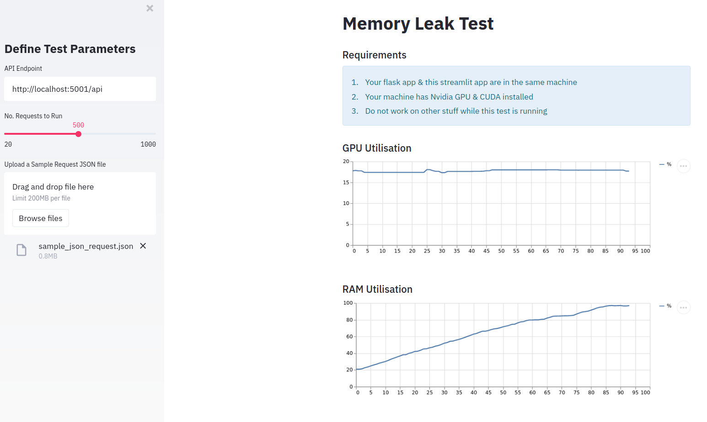

# streamlit-memoryleak

Machine learning API memory leak checker using Streamlit.

## Intro

When developing AI microservices for deployment, we need to test that the AI application do not have any discreet memory leakage that can consume either the GPU or RAM memory.

To do that, we usually have to run multiple requests over a period of time and track the memory usage to determine the presence of a leak.

This streamlit app makes it easier to do all that.

## Requirements

 * Works in Linux
 * `pip install -r requirements.txt`

## How to Use

 * `streamlit run app.py`: to launch the app
 * Read the additional requirements in the UI
 * Input parameters
 * Memory leak is likely present if the utilisation keep increasing overtime.

